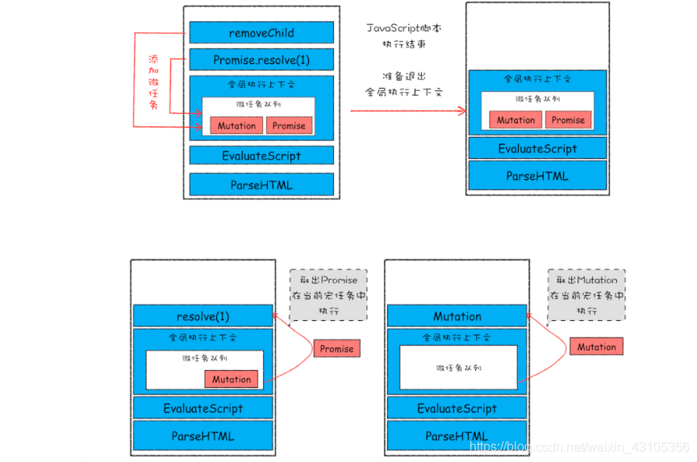

# 任务队列、事件循环、宏任务、微任务

## 调用栈 Call Stack

正式阐述任务队列与事件循环之前，大概了解一下`JavaScript`是如何运行的：

在`JavaScript`运行的时候，主线程会形成一个栈，这个栈主要是解释器用来执行函数
流的一种机制。通常这个栈被称为调用栈`Call Stack`，或者执行栈`Exacution Context Stack`。

调用栈，顾名思义是具有 LIFO(后进先出，Last In First Out)的结构。调用栈内存放的是代码执行
期间的所有执行上下文。

- 每调用一个函数，解释器就会把该函数的执行上下文添加到调用栈并开始执行

- 正在调用栈中执行的函数，如果还调用了其它函数，那么新函数也会被添加到调用栈，并立即执行

- 当前函数执行完毕后，解释器会将其执行上下文清除，继续执行剩余执行上下文中的剩余代码

- 但分配的调用栈空间被沾满，会引发`堆栈溢出`的报错

## 为何需要有任务队列与事件循环

一、JavaScript 是**单线程的**，一次只能运行一个任务。通常这没什么大不了的，但是现在想象你
正在运行一个耗时 30 秒的任务，比如请求数据、定时器、读取文件等等。在此任务中，我们等待 30 秒才能
进行其它任务操作（默认情况下，JavaScript 在浏览器的线程上运行，因此整个用户界面都停滞了），
后面的语句就得一直等着前面的语句执行结束才会开始执行。这不是我们想要的

二、浏览器每个渲染进程都有一个主线程，并且主线程非常繁忙，既要处理 DOM，又要计算样式，还要处理布局，
同时还需要处理 JavaScript 任务以及各种输入事件。要让这么多不同类型的任务在主线程中有条不紊地执行，
这就需要一个系统来统筹调度这些任务，这个统筹调度系统就是我们今天要讲的**任务队列**和**事件循环**。

三、要想在线程运行过程中，能接收并执行新的任务，就需要采用事件循环机制

四、能够接收其它线程发送的消息，一个通用的模式是任务队列

## 同步任务和异步任务

JavaScript 将所有执行任务分为了同步任务和异步任务。

其实我们每个任务都是在做两件事情，**发起调用**和**得到结果**。

同步任务和异步任务最主要的差别是，同步任务发起调用后，经计算后立即得到结果，而异步任务
是无法立即得到结果，比如请求接口，每个接口都需要响应时间，根据网速、服务器等因素决定。
再如定时器，他需要固定时间后才会返回结果。JavaScritp 对同步任务和异步任务执行机制不同。

**执行同步任务**，按照代码顺序和调用顺序，进入调用栈执行，执行结束后移除调用栈。

**执行异步任务**，首先它依旧会进入调用栈，然后发起调用，然后解释器会将其**响应回调任务**
放入一个任务队列，紧接着调用栈会将这个任务移除。当主线程清空后，即所有同步任务结束后，解释器
会读取任务队列，依次将**任务队列里已完成的异步任务**加入到调用栈并执行。

这里有个重点，异步任务不是直接进入任务队列的，等执行到异步任务的回调函数时推入到任务队列。

## 任务入队

任务进入任务队列，其实会利用到浏览器的其它线程。虽说`JavaScript`是单线程语言，但是浏览器
不是单线程的，而不同的线程会对不同的事件进行处理

- **js 引擎线程**：用于解释执行 js 代码、用户输入、网络请求等

- **GUI 渲染线程**：绘制用户界面，与 js 主线程互斥（因为 js 可以操作 DOM，进而会影响到 GUI 的渲染结果）

- **http 异步网络请求线程**：处理用户的 get、post 等请求，等返回结果后将回调函数推入到任务队列

- **定时器触发线程**：`setInterval`、`setTimeout`等待时间结束后，会把回调函数推入到任务队列

- **浏览器事件处理线程**：将`click`、`mouse`等 UI 交互事件发生后，将要执行的回调函数推入到事件队列中

```js
function respond() {
  return setTimeout(() => {
    return "Hey!";
  }, 1000);
}
```

在`web api`中，计时器的运行时间与我们传入的参数时间一样长，但回调不会立即添加到调用栈执行，而是会先被推入队列，
在队列中等待被执行。

## 任务队列与事件循环详解

### 任务队列

任务队列是一种数据结构，可以存放要执行的任务。它符合队列`先进先出`的特点，也就是说要添加任务的话，添加到队尾，
要取出任务的话，从队列头部去取。

在任务队列中，还分**宏任务队列（Task Queue）** 和 **微任务队列（Microtask Queue）**，对应的里面存放
**宏任何**和**微任务**。

**宏任务和微任务都是异步任务**

**常见的宏任务**
script(整体代码)、setTimeout、setInterval、I/O、UI 交互事件、postMessage、MessageChannel

**常见的微任务**
Promise.then、Object.observe、MuationObserver、process.nextTick(Node.js 环境)

### 事件循环

事件循环系统就是在监听并执行消息队列中的任务。

**事件循环的具体流程**：

- 从宏任务队列中，按照入队顺序，找到第一个执行的宏任务，放入调用栈，开始执行

- 执行完该宏任务下所有的同步任务，该宏任务被推出宏任务队列，然后微任务队列开始按照入队顺序，依次执行其中的微任务，直到微任务队列清空

- 当微任务队列清空后，一个事件循环结束

- 接着从宏任务队列中，找到下一个宏任务，开始第二个事件循环，直到宏任务队列清空

## 宏任务与微任务的关系

**JavaScript 是如何执行代码的**

解释器会将整体代码`script`放入宏任务队列，因此事件循环是从第一宏任务开始。

当 JavaScript 执行一段脚本的时候，V8 会为其创建全局执行上下文，在当前宏任务执行的过程中，有时候会产生多个
微任务，微任务队列会保存这些微任务。不过这个微任务队列是给 V8 引擎内部使用的，你是无法通过 JavaScript 直接访问的。

也就是说每个宏任务都关联了一个微任务队列。接下来，我们就需要分析两个重要的时间点，微任务产生的的时机和执行
微任务队列的时机。

先来看微任务是怎么产生的？在现代浏览器里，产生微任务有两种方式

- 第一种方式是使用 `MutationObserver`监控某个 DOM 节点，然后通过 JavaScript 来修改这个节点，或为这个节点
  添加、删除子节点，当 DOM 节点发生变化时，就会产生 DOM 变化的微任务

- 第二种方式是使用 Promise，当调用 Promise.resolve()或者 Promise.reject()的时候，产生微任务

现在微任务队列有了微任务，那么再看看微任务队列是何时被执行的。通常情况下，在当前宏任务中的 JavaScript 快执行完成时，
也就是 JavaScript 引擎准备退出全局执行上下文并清空调用栈的时候，JavaScript 引擎会检查全局上下文中的微任务队列，
然后按照顺序执行队列中的微任务。

如果在执行微任务的过程中，产生了新的微任务，同样会被该微任务添加到微任务队列中，V8 引擎一直循环执行微任务队列中的任务，
直到队列为空。也就是说在执行微任务过程中产生的新的微任务不会推迟到哦下个宏任务中执行，而是在当前的宏任务中继续执行。

## 代码的执行时机，有时候并不是你看到的顺序

在一个宏任务中，如果此宏任务创建了一个宏任务和微任务，无论什么情况下，产生的宏任务和微任务执行的顺序是
**微任务都要早于宏任务执行**

## 实例详解



该示意图在执行一个 ParseHTML 的宏任务，在执行过程中遇到了 JavaScript 脚本，那么就暂停
解析流程，进入到 JavaScript 的执行环境。从图中可以看到，全局上下文包含了微任务。在 JavaScript 脚本
的后续执行执行过程中，分别从 Promise 和 removeChild 创建了两个微任务，并添加到微任务列表中。接着 JavaScript 执行
结束，准备退出全局上下文，这时候到了检查点了，JavaScript 引擎为检查微任务列表，并依次执行这个两个微任务。等微任务队列
清空之后，就退出全局执行上下文。

## 页面性能

宏任务执行时间不能过长，因为会影响渲染线程（这两个线程互斥），有时候会出现页面卡顿这可能是产生的原因之一

宏任务在执行时，会创建自己的微任务队列，微任务的执行时长会影响当前宏任务的时长。比如，一个宏任务在执行过程中，
产生了 100 个微任务，执行每个微任务时长是 10 毫秒，那么执行 100 个微任务的时长是 1000 毫秒，也就是说当前
宏任务时长被延长了 1000 毫秒。
